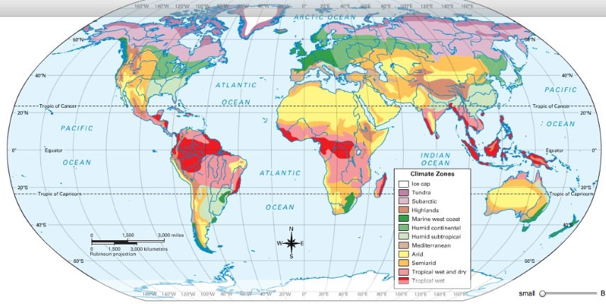
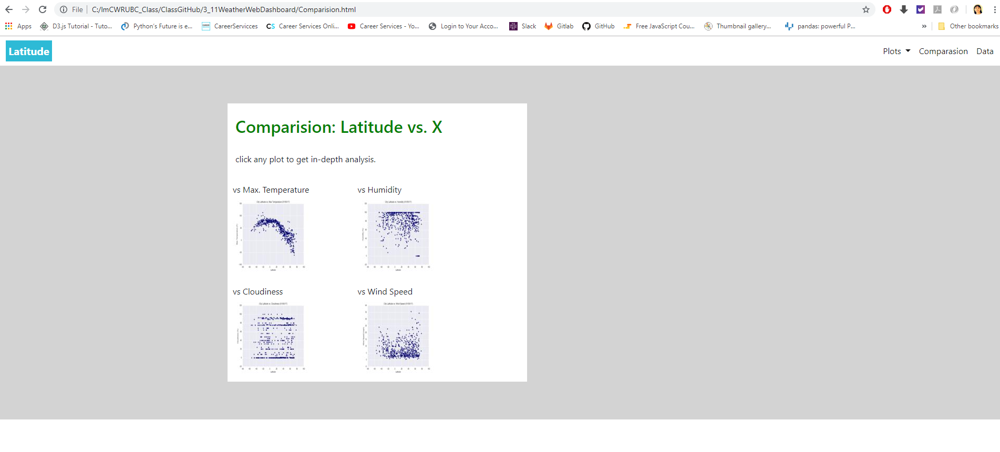
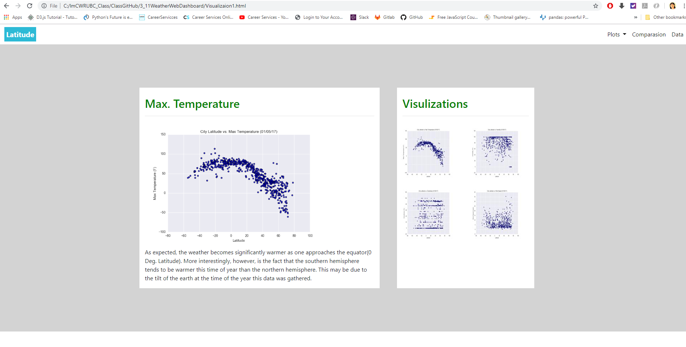
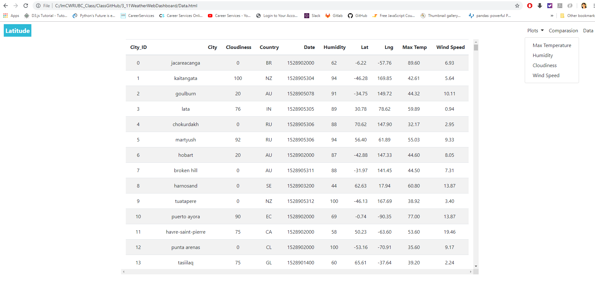

# Weather Web Dashboard

### This project used **Bootstrap Navbar** and **Bootstrap table** to create a visualization dashboard website to demonstrate the analyze on how weather changes as you get closer to the equator. 

- - -

- - -

## Technologies Used

*  **Bootstrap navbar**:  The navbar is one of the prominent features of Bootstrap sites. Navbars are responsive 'meta' components that serve as navigation headers for your application or site. Navbars collapse in mobile views and become horizontal as the available viewport width increases. At its core, the navbar includes styling for site names and basic navigation.
*  **Bootstrap table**:  It can makes a `Responsive Tables` by using 'table-responsive' class. It scrolls horizontally up to small devices (under 768px) and when viewing on anything larger than 768px wide no any difference.

## Project Files:

* **index.html**: It is the landing page containing an explanation of the project and links to each visualizations page. 

* **Comparision.html**: Contains all of the visualizations on the same page so we can easily visually compare them.

* **Visualizaion1-4.html**: These four visualization pagea include plot/visualization itself for the selected comparison and a paragraph describing the plot and its significance.

* **Data.html**: It is a bootstrap table component generated from a pandas dataframe by using Pandas' method `to_html()`. 

## Final Results

By sending requests from **Brower** to the **Flask Server** can get below results: 

- - -

- - -

