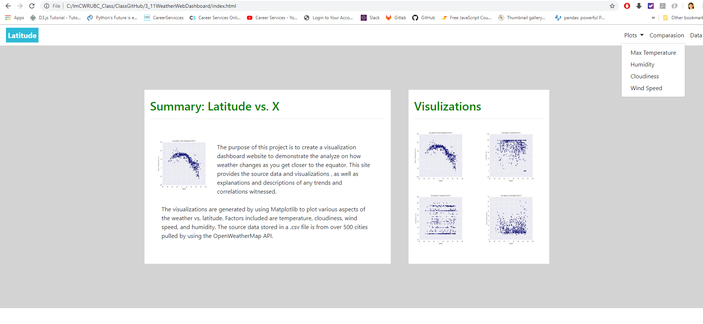

# World Wide Weather Analyzing and Web Dashboard Demonstrating

### This project first used **numpy**, **CityPi and OpenWeatherMap APIs** to generate city weather data  and used **matplotlib** plot the weather data for analyzing, then use **Bootstrap Navbar** and **Bootstrap table** to create a visualization dashboard website to demonstrate the analyzing results of how weather changes as you get closer to the equator(Latitude=0). 

- - -

- - -

## Technologies Used

*  **numpy**:  1500 sample geo-coordinates(list of latitude and longitude pairs) are drawnfrom a `uniform distribution`. 

*  **CityPi and OpenWeatherMap APIs**:  Using `CityPi` API to get city name list whose population is over 500 based on geo-coordinates and using `OpenWeatherMap` API to get current and historical weather data.

*  **matplotlib**: Matplotlib is a `plotting library` for the Python programming language and its numerical mathematics extension NumPy.  

*  **Bootstrap navbar**:  The navbar is one of the prominent features of Bootstrap sites. Navbars are `responsive` 'meta' components that serve as navigation headers for your application or site. Navbars collapse in mobile views and become horizontal as the available viewport width increases. At its core, the navbar includes styling for site names and basic navigation.
*  **Bootstrap table**:  It can makes a `Responsive Tables` by using 'table-responsive' class. It scrolls horizontally up to small devices (under 768px) and when viewing on anything larger than 768px wide no any difference.

## Project Files:

* **APICall\WeatherPy.ipynb**: Python code for performing API calls and doing plottings.

* **APICall\output_data\cities.csv**: It is the data file generated by using `pandas.to_csv()` in WeatherPy.ipynb. It includes fields City, Cloudiness, Country, Date, Humidity, Lat, Lng,MaxTemp, WindSpeed.

* **APICall\fig1-4.pgn**: These four plots are generated by using `matplotlib.pyplot()` in WeatherPy.ipynb.

* **index.html**: It is the landing page containing an explanation of the project and links to each visualizations page. 

* **Comparision.html**: Contains all of the visualizations on the same page so we can easily visually compare them.

* **Visualizaion1-4.html**: These four visualization pagea include plot visualization itself for the selected comparison and a paragraph describing the plot and its significance.

* **Data.html**: It is a bootstrap table component generated from a pandas dataframe by using Pandas' method `to_html()`. 

## Final Results

By sending requests from **Brower** to the **Flask Server** can get below results: 

- - -

- - -
